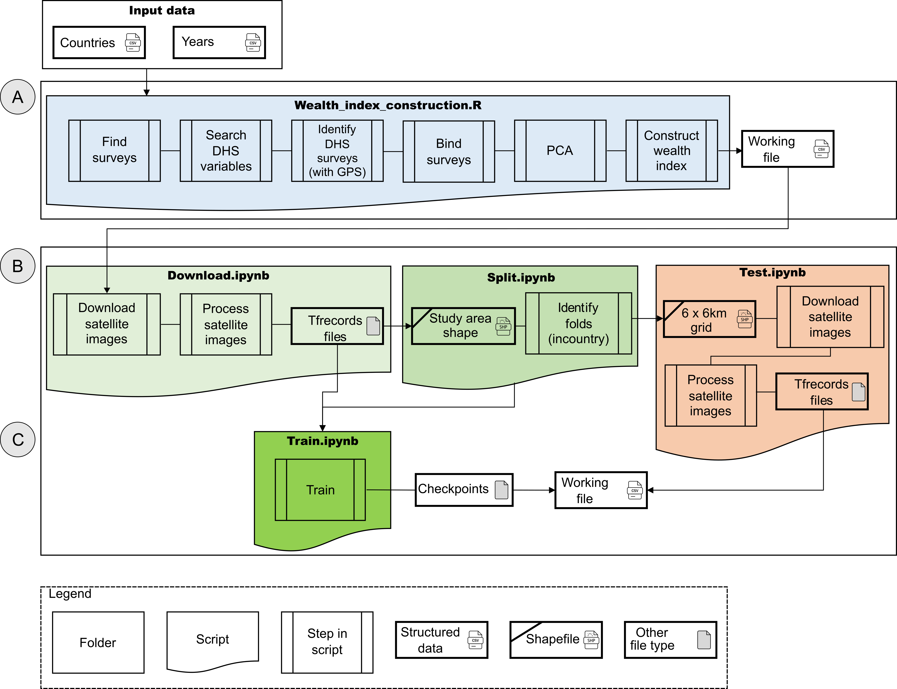

<!-- badges: start -->

<!-- badges: end -->

# DeepWealth

## Required software and library

The main software used was Python 3.7 with TensorFlow r1.15.
The complete list of required packages and library are listed in the `Deepwealth.yml` (conda env create -f Deepwealth.yml) file (it need to install 'conda')

## Summary

The aim of the DeepWealth  is to propose a Generalizable Deep Learning Framework to use Satellite Images for Poverty Estimation.

- [X] The integration of Deep Learning and Earth Observation data is being increasingly used to estimate socioeconomic conditions at regional and global levels.
- [X] The relevance of socioeconomic conditions mapping for various purposes such as determining earth system impacts and urban planning.
- [X] The introduction of the DeepWealth framework aligning with the Sustainable Development Goal (SDG1) of ending poverty
- [X] Providing open-source data, code, and training models (checkpoints) for reproducibility and replicability.

## Workflow

The code was split into three primary components. The data and scripts available on the DeepWealth data repository are held in 3 folders:

- [X] **(A)** 'R scripts' for generating the geographic  coordinates at a scale of ~6 km2 in each study area and for wealth index construction from available surveys
- [X] **(B)** 'Python scripts' providing all notebook scripts to enable reproduction and replication of the poverty estimation pipeline, and
- [X] **(C)**'Checkpoints' for the trained models for both multispectral and nighlight satellites images  to be used for future case studies.

### Data

***Geographic location***

- ~37000 African villages in 24 countries (Angola, Benin, Burkina Faso, Cameroon, Cote d'Ivoire, Democratic Republic of Congo, Ethiopia, Ghana, Guinea, Kenya, Lesotho, Malawi, Mali, Mozambique, Nigeria, Madagascar, Rwanda, Senegal, Sierra Leone, Tanzania, Togo, Uganda, Zambia, and Zimbabwe).
- 92 surveys from DHS conducted between the years 1996 and 2019.
  ***Datasets***

- [X] ***Dataset title:*** Wealth index constructed from the Demographic and Health Surveys(DHS), ***Dataset DOI or URL:*** https://dhsprogram.com/data/available-datasets.cfm
- [X] ***Dataset title:*** LANDSAT/LC08/C01/T1_SR, LANDSAT/LE07/C01/T1_SR, LANDSAT/LT05/C01/T1_SR, NOAA/DMSP-OLS/CALIBRATED_LIGHTS_V4, NOAA/VIIRS/DNB/MONTHLY_V1/VCMSLCFG, ***Dataset DOI or URL:***  https://earthengine.google.com/
- [X] ***Dataset title:*** ResNet-18 architecture (v2, with preactivation on Imagenet), ***Dataset DOI or URL:*** https://doi.org/10.48550/arXiv.1603.05027

### Wealth Index Construction

Wealth index construction: The wealth index was constructed from the first principal component of the DHS responses using the principal component analysis (PCA). It included the number of rooms occupied in a house, whether the house has electricity, the quality of flooring in the house, water       supply and whether the house has a toilet, ownership of a telephone, radio, television, cars, and motorcycles.

### Deep Learning estimation model

a Deep Learning (DL) methodology to understand economic well-being. It estimated the wealth index from multi-spectral satellite imagery using DL techniques. A pre-trained CNN model based on Resnet-18 architecture was used

### Scripts

**See in  `src/Python/steps`**

- [X] 0_Download.ipynb: Download the satellite images based on the wealth index csv file
- [X] 1_process_tfrecords.ipynb: Split the  downloaded TFrecords file by country_year_villages
  using the csv file
- [X] 2_create_incountry_folds.ipynb: Split the data into five folds using incountry configuration (based on the distance between villages in order to avoid the overlapping of the satellite image).
- [X] 3_dhs_baslines.ipynb: Generate a .npz file that resumes the Night Light images features (center, mean, etc.) Run the machine learning baselines
- [X] 4_dhs.ipynb: Generate a DataFrame that merges the .npz file generated in step 3 with the original csv file
- [X] 5_train.ipynb: Contains all training scripts for all configurations
- [X] 6_dhs_resnet_ridge.ipynb: Apply a ridge regression to concatenate the Resnet-MS and Resnet-NL
- [X] 7_dhs_incountry.ipynb: Calculate the performance metrics for all configuration
- [X] 8_test.ipynb: Test the training models for new villages

**See in `src/R/Wealth_index_construction`**

- [X] Wealth_index_construction: Construct the wealth index from the DHS surveys

**See in `src/R/Grid/mada`**

- [X] Grid_script: Calculate the (lat, lon) for a given country with a pixel ~6 km2

## Outputs

### Case 1: Madagascar

We focused on the entire country of Madagascar. Specifically, we downloaded the shapefile from (https://gadm.org/). We used a ([script](src/R/Grid/mada/grid_script.R)) to divide the map into pixels of approximately 36 km2. We generated 20,427 villages, with the dataset available in ([dataset](data/Madagascar)). This dataset includes the latitude and longitude from the centroids of each village, also known as clusters.

### Case 2: Brazil

We focused on Vale do Ribeira located in the southern region of Brazil. Specifically we downloaded the shapefile from IBGE (Brazilian Institute of Geography and Statistics) containing the 880 census tracts ([dataset](data/Brazil/VR_clusters.csv)). This dataset contains the lat/lon from the centroids of each census tracts and their corresponding HDI-income(Human Development Index) value that was obtained from by Machicao et al. [14] ([DOI](https://doi.org/10.5334/dsj-2022-006)). The income was used for validate DeepWealth, the Pearson correlation obtained was R2 = 0.53 ([see](data/Brazil/suppMaterialS1.xlsx)).

### Case 3: Japan

For Japan case, we concentrated in Kita-Tōhoku region, the northernmost part of Honshū Island. We used 15 municipalities (most of them with less than 20,000 population). For this area, we collected information from a total of 517 census tracts (city/rural block) ([dataset](data/Japan/JP_clusters.csv)). This dataset contains the lat/lon from their centroids. For validation, we calculated the average estimation from each municipality and calculated Pearson correlation using two indicators: Human Development Index (HDI-income) and Taxable Income Per Taxpayer (TXI). The Pearson correlation obtained was R2 = 0.64 and R2 = 0.51, respectively ([see](data/Japan/suppMaterialS2.xlsx)).

## Trained models (checkpoints)

The checkpoints can be found separately (due to size restrictions) ([DOI](https://doi.org/10.5281/zenodo.10575637])).

---

---

## Tutorial to configureate an AWS EC2 Setup with TensorFlow 1.15.5 

This guide will help you create an EC2 instance on AWS using the Amazon Deep Learning AMI and set up a Python 3.7 environment with TensorFlow 1.15.5, as pre-requisites for DeepWealth.

### Prerequisites 
*   An AWS account
*   AWS CLI configured on your local machine

### Step 1: Launch an EC2 Instance 

1.  **Log in to AWS Management Console:** Go to the [AWS Management Console](https://aws.amazon.com/console/), and navigate to EC2 Dashboard.
    
2.  **Launch Instance:** Click on the "Launch Instance" button.
    
3.  **Choose an Amazon Machine Image (AMI):**
    
*  **Search for the "Deep Learning AMI"** in the AWS EC2 console search bar. These Amazon Machine Images (AMIs) are specifically built and optimized for building, training, debugging, and serving deep learning models in EC2. They come pre-configured with popular frameworks such as TensorFlow, MXNet, PyTorch, and more.
    
* **Choose a suitable AMI**:
    
    *   For example, select  **Amazon Deep Learning AMI (Amazon Linux 2) Version 60.2 (ami-0b5c0921a4f222d9a)**. This AMI includes the Nvidia Driver and an updated version of TensorFlow, along with other essential packages already installed.
    *   Note: As of 2024, AWS no longer hosts earlier versions of TensorFlow, as they have been deprecated. However, by using this AMI, you ensure that your instance has GPU support. We will then downgrade TensorFlow to version 1.15.5.
4.  **Choose an Instance Type:**
    
    *   Select an instance type that includes a GPU, such as `g4dn.xlarge` .
5.  **Configure Instance Details:**
    
    *   Adjust the settings as needed for your use case.
    *   Ensure you have a suitable VPC and subnet selected.
6.  **Add Storage:**
    
    *   The default storage settings should suffice (depending on the images size, we recommend more than 50GB), but you can adjust as needed.
7.  **Add Tags:**
    
    *   (Optional) Add any tags to help manage your instances.
8.  **Configure Security Group:**
    
    *   Create a new security group or select an existing one.
    *   Ensure you have rules to allow SSH (port 22) access. Also donwload the `your-key-pair.pem`.
9.  **Review and Launch:**
    
    *   Review your settings and click "Launch".
    *   Select an existing key pair or create a new one to SSH into your instance.

### Step 2: Connect to the EC2 Instance via SSH 
       
    `ssh -i /path/to/your-key-pair.pem ec2-user@your-ec2-instance-public-dns`
    

### Step 3: Set Up Python Environment with TensorFlow 1.15.5 
1. Use `pip` to install and manage your Python environment.
    *   Create and activate a new Python virtual environment:
                
        `python3 -m venv myenv source myenv/bin/activate`
        
    *   Install Python 3.7 within the environment:
               
        `pip install python==3.7`
        
    *   Install TensorFlow 1.15.5:
         
        `pip install tensorflow==1.15.5`
        
   *   Install all Required packages and library
         `pip install tensorflow==1.15.5`
          `conda install -c conda-forge tensorflow-gpu=1.15`
          `conda install -c conda-forge tqdm`
          `conda install -c anaconda seaborn`
          `conda install -c anaconda pillow`
          `conda install -c conda-forge sklearn`
          `conda install -c conda-forge mypy`
          `conda install -c conda-forge matplotlib`
          `conda install -c conda-forge jupyterlab`
          `conda install -c conda-forge jupyter_contrib_nbextensions`
          `conda install geopandas`
          `conda install -c anaconda flake8`
          `conda install -c conda-forge cartopy=0.18.0`
          `conda install -c conda-forge earthengine-api`

    
2.  **Verify the Installation:**
     
    `python -c "import tensorflow as tf; print(tf.__version__)"`
    
    You should see `1.15.5` as the output.
     
